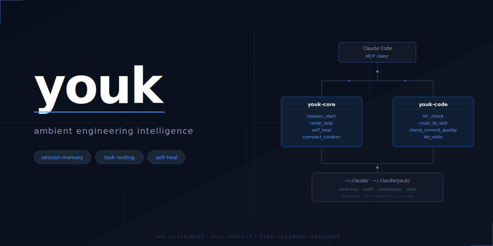

<div align="center">



[](https://github.com/ajinkyabhanudas/youk/actions/workflows/ci.yml)
[](https://www.python.org/)
[](https://www.docker.com/)
[](https://modelcontextprotocol.io)
[](https://github.com/astral-sh/ruff)
[](LICENSE)
[](https://github.com/ajinkyabhanudas/youk)

</div>

---

youk turns Claude Code from a chat assistant into an engineering system with persistent memory, structured task routing, live guard rails, and domain-specialized variants. It runs in Docker containers, speaks the Model Context Protocol, and learns across sessions without ever storing raw conversation transcripts.

> **Status:** Active development — v0.1.0. Core variant (youk-core + youk-code) is live.

---

## What youk does

| Problem | youk mechanism |
|---|---|
| Context resets every session (15 min re-establishment tax) | `session_start()` detects project type, loads contracts + decisions, gives you a resume point |
| Behavioral contracts get blurred by Claude's auto-compaction | `compact_context()` runs at 25+ exchanges — tiers content, preserves contracts verbatim |
| Ceremony mismatch (too much process for a typo, too little for a migration) | `route_task()` sizes the task and returns the right ceremony level and skill list |
| Working agreements aren't durable (live in conversation, not files) | `session_end(explicit_contracts=[...])` writes them to `contracts.md`; every future session loads them first |
| No guard rails — Claude can commit credentials | `check_commit_quality()` blocks credential files at tool level (hard rule, not suggestion) |
| Self-improvement is manual | `self_heal()` reads 30 days of audit logs, generates improvement proposals — never auto-applies |
| Sessions start reactive with no plan | `session_start()` returns `session_plan` — a 3-5 item forward-looking proposal built from contracts + context, not a question |
| Skills are static and generic | `generate_skill()` + `assess_skill()` — signal-driven skill generation and evolution from repo context, audit gaps, and best-practices knowledge |

---

## Prerequisites

- **Claude Code** (the Anthropic CLI) — [install guide](https://docs.anthropic.com/en/claude-code)
- **Docker Desktop** 24+ (must be running)
- **Python 3.11+** (for local validation scripts)
- **Anthropic API key** in your environment: `export ANTHROPIC_API_KEY=sk-...`

---

## Quick start

```bash
curl -sL https://raw.githubusercontent.com/ajinkyabhanudas/youk/main/scripts/install.sh | bash
```

The installer handles everything: preflight checks, Docker build, MCP server registration, CLAUDE.md patch, and a validation run. First install takes ~2 minutes (Docker image build). Re-runs are safe — all steps are idempotent.

**Prerequisites:** Docker Desktop running · Claude Code installed · `ANTHROPIC_API_KEY` in your shell profile.

After the installer exits, open a new Claude Code session. youk starts automatically — no activation phrase.

**Verify the install:**

```bash
bash ~/.claude/youk/scripts/doctor.sh
```

`doctor.sh` checks every dependency and gives a specific `Fix:` line for anything that fails.

---

## How it works

youk is two Docker containers registered as MCP servers in Claude Code:

```
┌─────────────────────────────────┐
│           Claude Code           │
│         (MCP client)            │
└──────────┬──────────┬───────────┘
           │          │
    ┌──────▼──┐  ┌────▼──────┐
    │youk-core│  │youk-code  │
    │         │  │           │
    │session  │  │nfr_check  │
    │routing  │  │skills     │
    │health   │  │review     │
    └──────┬──┘  └────┬──────┘
           │          │
    ┌──────▼──────────▼──────┐
    │   ~/.claude/ (volume)  │
    │   skills, context,     │
    │   audit logs           │
    └────────────────────────┘
```

**youk-core** (read-write access):
- `session_start(project_dir)` — detects project type (Python/JS/Go/Rust), loads contracts + decisions, returns resume point
- `compact_context(project_dir)` — builds a tiered context brief from structured files; call at 25+ exchanges to preempt Claude's generic auto-compaction
- `session_end(summary, commits_made, explicit_contracts)` — writes audit log, saves working agreements to `contracts.md`
- `route_task(task)` — sizes the task (XS→XL), returns skill list and ceremony level
- `optimize_intent(raw_input)` — compresses vague/multi-part input into a structured intent brief before routing
- `check_command(command)` — enforces the no-destructive hard rule at tool level
- `self_heal()` — analyzes audit logs, generates improvement proposals
- `get_proposals()` / `apply_proposal(id, confirmed)` — proposal review and two-step apply

**youk-code** (read-only access):
- `nfr_check(task, size)` — XS/S: instant 2-question check; M: 4-question API block; L/XL: full check
- `route_to_skill(skill, task)` — loads any skill's SKILL.md and runs it against your task
- `check_commit_quality(message, file_paths)` — scores commit, blocks credential files
- `list_skills()` — lists all skills with health status; `has_skill_md: false` = gap
- `generate_skill(name, purpose, project_context, signal_type)` — generates a new SKILL.md from repo context + best-practices knowledge + skill schema
- `assess_skill(skill_name)` — assesses an existing skill against audit evidence and cross-project patterns; returns gaps + proposed additions
- `detect_skill_gaps()` — aggregates all signals (missing skills, audit gaps, uncovered best-practice patterns) into a prioritised list

Both containers mount `~/.claude/` via Docker volumes. youk-core has write access (writes session state, knowledge entries, audit logs). youk-code has read-only access (reads skills, config, context).

---

## Guard rails

Guard rails are machine-readable contracts in `config/guardrails.yaml`. Hard rules are enforced at the tool level — they block, not suggest.

**Hard rules (block):**

| Rule | What it stops |
|---|---|
| `no-auto-apply-proposals` | Self-heal proposals auto-applying without your review |
| `no-credential-commits` | `.env`, `*secret*`, `*api_key*` files entering a commit |
| `knowledge-extraction-not-logging` | Raw conversation transcripts being stored |
| `no-destructive-without-confirm` | `rm -rf`, `reset --hard`, force push without confirmation |

**Soft rules (suggest once, skippable):**

| Rule | What it surfaces |
|---|---|
| `nfr-before-m-tasks` | Run NFR check before M+ sized tasks |
| `spec-before-l-tasks` | Write a spec before L/XL tasks |
| `session-close-cluster` | context-sync + learn + humanize at session end |
| `adr-for-real-alternatives` | Document architectural decisions with rejected options |

To add or change a rule: edit `config/guardrails.yaml` and commit. Guard rails are not prompt instructions — they're versioned code.

---

## Living knowledge

`knowledge/` stores what youk has learned — not what was said.

```
knowledge/
├── KNOWLEDGE-INDEX.md          ← health status, what exists
├── interpretation/
│   ├── user-intent.md          ← how your phrases map to actual intent
│   └── task-signals.md         ← what signals reveal task size
├── clarifications/
│   └── YYYY-MM/
│       └── YYYY-MM-DD-{slug}.md   ← one entry per intent-resolution case
├── domain/                     ← symlink to your existing skill knowledge base
└── proposals/
    └── PENDING.md              ← self-heal proposals awaiting review
```

Each session, `session_end` extracts structured insights and writes them here. Raw transcripts are never stored — that's enforced by the `knowledge-extraction-not-logging` hard rule.

Every 3 sessions, `self_heal` reads the last 30 days of audit logs and generates improvement proposals. Proposals sit in `PENDING.md` until you review and approve them via `apply_proposal(id, confirmed=True)`.

---

## Skill lifecycle

Skills are not static files — they generate and evolve from signals.

**Generation triggers:**
- `route_task` returns a skill with no SKILL.md (`has_skill_md: false` in `list_skills()`)
- Project type detected at session start with no domain skill (e.g. Python ML project, no `python-ml` skill)
- Best-practices pattern in `cross-project.md` not encoded in any existing skill
- Engineer explicitly requests a new skill

**Evolution triggers:**
- `self_heal()` returns `skill_gap_signals` — skills with recurring `SkillGap:` lines in audit logs
- Session ends with `skill_gaps={"skill-name": ["what was missed"]}` in `session_end()`
- `assess_skill()` called directly reveals coverage gaps

**The loop:**
```
repo context / audit signals
        ↓
generate_skill() or assess_skill()
        ↓
add_proposal()          ← queued to PENDING.md, never auto-applied
        ↓
apply_proposal(confirmed=True)   ← founder reviews and approves
        ↓
updated SKILL.md        ← read at runtime via volume mount, no rebuild
```

`knowledge/skill-schema.md` is the canonical template that drives generation — it defines required sections, phase structure, quality bar conventions, and anti-patterns. Generated skills follow the same structure as hand-written ones.

---

## Task routing

`route_task(task)` returns:

```json
{
  "size": "M",
  "ceremony": "standard",
  "skills": ["nfr_check", "dev_loop", "code_review", "verify"],
  "nfr_mode": "quick_4q",
  "token_budget": 75000,
  "warnings": ["NFR check recommended before this task"]
}
```

Sizes: **XS** (typo, clarification) → **S** (bug fix, config) → **M** (feature, refactor) → **L** (system, architecture) → **XL** (new project, migration)

Routing uses **net-score**: positive signal matches minus (negative matches × 2). "implement a typo fix" routes XS not M — the `typo` negative signal cancels the `implement` positive.

Routing logic lives in `config/routes.yaml` — readable, editable, committed. Token budgets per size: XS 5k · S 25k · M 75k · L 200k · XL 500k.

---

## Workflow commands

Five commands compose the underlying skills. Type them in Claude Code — youk routes silently.

| Command | Composes | When |
|---------|---------|------|
| `/build` | route_task → nfr_check (M+) → dev-loop | Implementing a feature |
| `/done` | code-review → verify → humanize | Just finished implementing |
| `/check` | code-review → security-review (if auth in scope) | Before committing |
| `/decide` | adr | Making an architectural choice |
| `/health` | self_heal() | "How is the system doing?" |
| `/plan` | compact_context → session_plan rebuild | Refocus mid-session |

Aliases: `/requirements` → nfr_check · `/spec` → write-spec · `/review` → code-review

---

## Variants

youk is a platform. Each variant is one Docker image + one server file specialized for a domain:

| Variant | Domain | Status |
|---|---|---|
| youk-core | Session, routing, self-healing | Live |
| youk-code | Software engineering | Live |
| youk-pm | Product management, specs, ADRs | Planned |
| youk-research | Research, synthesis | Planned |
| youk-design | UX, Figma integration | Planned |
| youk-analytics | Production metrics loops | Planned |

Adding a variant means building one Dockerfile, one server.py, one entry in `config/variants.yaml`, and one `claude mcp add` command. The pattern is in [docs/variants.md](docs/variants.md).

---

## Context management

youk's context compaction runs proactively — before Claude's generic auto-compaction can blur behavioral contracts.

At 25+ exchanges (or when context feels dense), Claude calls `compact_context(project_dir)`. The tool builds a brief from structured knowledge files, not by summarizing conversation. Content is tiered:

| Tier | What it is | How compacted |
|---|---|---|
| CONTRACT | Behavioral agreements (commit format, test cadence) | Preserved verbatim, always first |
| DECISION | Architectural choices with rationale | Key fact + 1-sentence rationale |
| EXPLORATION | Depth dives, explanations | 1 sentence |
| CLARIFICATION | One-shot Q&A | Dropped entirely, re-ask if needed |

Working agreements detected mid-session are saved via `session_end(explicit_contracts=[...])` to `knowledge/projects/{slug}/contracts.md`. Every future `session_start` loads them first. `compact_context` pins them in every brief. They are immune to compaction because they come from files, not conversation history.

---

## Cross-project learning

youk learns at three scopes: project, domain, global.

```
knowledge/
├── projects/
│   └── {slug}/
│       ├── contracts.md    ← working agreements (always loaded first)
│       ├── decisions.md    ← architectural decisions + rationale
│       └── context.md      ← project type, tech stack, gate progress
├── interpretation/         ← how your phrases map to intent (global)
└── proposals/
    └── PENDING.md          ← self-heal proposals awaiting review
```

A correction that happens 3+ times in one project gets promoted to domain-level knowledge. The same pattern across 2+ projects promotes to global. Confidence scoring (+0.05 on reference, -0.1 on contradiction) keeps the knowledge base calibrated over time.

**Zero footprint in your repo.** All knowledge writes to `~/.claude/youk/knowledge/`. Your project's git history is untouched. youk reads your project (project type detection, git log for resume point), never writes to it.

---

## Development commands

```bash
# Build both images
make build

# Run tests (tools/list handshake)
make test

# Full rebuild from scratch
make rebuild

# Health check with actionable Fix: lines
bash scripts/doctor.sh
```

---

## Repository structure

```
youk/
├── config/
│   ├── guardrails.yaml     ← hard + soft rules (machine-readable)
│   ├── routes.yaml         ← task sizing + skill routing logic
│   └── variants.yaml       ← active variants
├── servers/
│   ├── shared/             ← Python modules shared across containers
│   │   ├── models.py       ← dataclasses (SessionState, RoutingDecision, ...)
│   │   ├── guardrails.py   ← rule enforcement
│   │   └── skill_loader.py ← reads SKILL.md files from volume mount
│   ├── core/               ← youk-core container
│   │   ├── Dockerfile
│   │   └── src/            ← server.py, session.py, routing.py, health.py, compaction.py
│   └── code/               ← youk-code container
│       ├── Dockerfile
│       └── src/            ← server.py, nfr.py, skills.py, review.py, skill_gen.py
├── knowledge/              ← living knowledge base (committed to repo)
│   ├── skill-schema.md     ← canonical SKILL.md template (drives generate_skill)
│   └── cross-project.md    ← best-practices patterns (feeds generation + assessment)
├── scripts/
│   ├── install.sh          ← one-command idempotent setup (curl | bash)
│   └── doctor.sh           ← health check with Fix: lines per failure
├── docs/
│   ├── getting-started.md
│   ├── guardrails.md
│   └── variants.md
├── Makefile
├── PHILOSOPHY.md
└── README.md
```

---

## Troubleshooting

**Run `doctor.sh` first — it diagnoses and gives Fix: lines for every known failure:**

```bash
bash ~/.claude/youk/scripts/doctor.sh
```

**`claude mcp list` shows youk-core/youk-code as disconnected**

Docker may not be running, or the images need rebuilding. Doctor will tell you which.

**`compact_context` returns empty contracts**

No contracts have been saved yet for this project. Call `session_end` with `explicit_contracts=[...]` at the end of your first session to seed them.

**Build fails with `COPY servers/shared/ /shared/` error**

Build must run from the repo root. The Makefile handles this — use `make build`, not `docker build` directly.

---

## Philosophy

Eight principles drive every design decision in youk. The full document is [PHILOSOPHY.md](PHILOSOPHY.md). The short version:

1. **Ambient over activated** — no "activate" phrase, always on
2. **Extract, don't log** — knowledge is insights, not transcripts
3. **Propose, never auto-apply** — self-healing requires founder approval
4. **Guard rails are versioned contracts** — committed YAML, not prompt text
5. **Ceremony proportional to risk** — XS task gets no ceremony, XL task gets full architecture review
6. **Variants are forms of intelligence** — specialization, not sprawl
7. **The repo is the truth** — everything important is in git
8. **Build the foundation right, then build fast** — Phase 1 is permanent

---

## Contributing

youk is a personal system in active development. Issues and pull requests are welcome, but changes that affect the guard rail contracts or knowledge structure need explicit discussion first — those are the load-bearing walls.

---

## License

MIT
