<div align="center">



[](https://github.com/ajinkyabhanudas/youk/actions/workflows/ci.yml)
[](config/)
[](tests/test_health.py)
[](https://www.python.org/)
[](https://www.docker.com/)
[](https://modelcontextprotocol.io)
[](https://github.com/astral-sh/ruff)
[](LICENSE)
[](https://github.com/ajinkyabhanudas/youk)
[](https://github.com/ajinkyabhanudas/youk/wiki)

coverage enforced in CI at ≥85% (`--cov-fail-under`); badge regenerated via `make coverage-badge`

</div>

---

## The compounding developer

Session 1: Claude knows nothing about your project. You re-explain the stack, the constraints, what you decided last week.

Session 10: Claude opens knowing your working agreements, your architecture decisions, your exact resume point. It routes a one-liner differently than a new feature. Skills it got wrong last month have already been patched. Patterns from another project loaded automatically.

**That's the difference youk makes. Nothing changes in your workflow except the install.**

| Without youk | With youk |
|---|---|
| Re-explain the project every session | Picks up where you left off — automatically |
| Working agreements live in chat, then vanish | Written to files, loaded at every future session |
| Generic AI regardless of task size or stack | Routed to the right ceremony for your context |
| Lessons lost when the session ends | Accumulated in audit log, feeding skill evolution |
| Same gaps recur despite correction | /learn extracts patterns — written to your knowledge base |
| Skills that fail keep failing | Skills that fail get patched in the session they fail |
| Same gaps recur across projects | Detected, promoted to cross-project knowledge |
| No institutional memory | Architecture decisions from six months ago still present today |

> **Status:** Active development — v0.1.0. Compounding begins immediately. Gains become visible around session 10-20 as the audit log fills and skills get tuned to your patterns.

---

## It also improves itself

Context memory is the foundation. What's built on top of it is the part that compounds faster.

When youk doesn't have a skill for something you're doing, it generates one from the task itself. Not a generic template. One built from what you were actually trying to do, your stack, and the best-practice patterns accumulated across your projects.

When a skill fails or gets skipped in a session, it gets patched before that session ends. Not queued for next time. The session that exposed the gap is the one that fixes it.

Self-heal reads the last 30 days of sessions and surfaces structural improvements — recurring gaps, skipped skills, patterns that keep coming back. You review and approve them. Structural code and config changes never apply without your review. Skill text (SKILL.md) is the one exception — it is patched in-session, with the diff written to the audit trail (see PHILOSOPHY.md §3 for why).

`/learn` isn't logging. It maps what you encountered today to what you already know, explicitly calls out where the analogy breaks down, and writes that to your knowledge base. Cross-project patterns are surfaced by self-heal for your review; you approve them via apply_proposal. You don't extract the lesson manually — it does that.

The result: the longer you use it, the fewer corrections you have to make. That's the compounding part.

---

## Is youk getting better?

Skills that are observed failing or being silently skipped are assessed and patched *within the same session* — not deferred to the next one. Structural code changes still go through `PENDING.md` for your review. Every `/health` run writes to `state/improvement-metrics.json`, which tracks up to 20 health cycles so trend direction is visible over time.

Run `/health` at any point. It returns an `org_score` (0–10) and a `loop_verdict`:

| Verdict | Meaning |
|---|---|
| **IMPROVING** | org_score rising session over session; loop is closing |
| **STEADY** | Score stable; maintaining but not accelerating |
| **STALLED** | Loop not closing — most likely `/done` is not firing at session end |
| **COLD** | Fewer than 3 sessions — not enough data yet |
| **REGRESSING** | Score falling — review recent proposals and skipped skills |

The score is driven by five signals: skill_invocation_rate (did a capability skill fire? — primary, 2.0 weight), close_cluster_rate (did you type `/done`? — 0.5 weight), gap_resolution_rate (are recurring gaps being fixed? — 0.5 weight), prevented_cost_score (did skills catch real findings, reversals, NFR gaps? — 0.5 weight), framing_accuracy_rate (was the goal correctly translated before work started? — 0.5 weight). The primary lever is **capability skill invocation** — a session where you used `/build`, `/review`, or `/done` (includes `/learn`) compounds your ability. A discipline gate caps org_score at 6.5 if 3+ consecutive sessions have zero capability skills — the gate lifts when you next invoke one. The score is capped at 10.0; in practice scores of 6–8 indicate a healthy loop (author's observed score after ~40 sessions: 6.3).

**M+ gate chain (what `/build` runs):** For features and non-trivial tasks, four gates run before code is written: (1) `optimize_intent` collapses scope ambiguity — but also detects intent-opaque goals (quality words like "better", mindset language like "discover the pattern") and surfaces a goal-translation question before proceeding, (2) `route_task` enforces both gates — blocks on scope ambiguity AND intent opacity, (3) `nfr_check` answers four questions (performance, reliability, security, observability) to produce an NFR Decision Block, (4) `check_nfr_gate` confirms the block is present before dev-loop starts. Each gate is tool-enforced — skipping it requires the tool to return `blocked=false`, not just deciding to proceed.

**What to do when STALLED:** use `/build` for code tasks and `/done` at session end. The score responds to capability skill invocation first, close rate second.

**Exporting your stats:** Run `make export-stats` to write a `STATS.md` file — org_score trajectory, skill invocation rate, and session close rate in shareable markdown. The export includes a caveat: org_score measures process discipline (did the gates fire?), not outcome quality (was the code correct?). Stats are meaningful above 15 sessions; the export warns if you're below that threshold. [Author's stats →](STATS.md)

---

## Quick start

Three tiers — pick the one that matches what you have right now:

| Tier | What you get | Setup |
|---|---|---|
| **youk-lite** | Memory across sessions (contracts, resume point, decisions) | Copy 8 lines into CLAUDE.md |
| **youk + contracts** | Memory + contracts survive git clone (shared across machines) | Copy CLAUDE.md + commit contracts.md |
| **full youk** | Everything + skill routing, self-healing, compounding loop | One install command, Docker required |

Start with youk-lite. Upgrade when the memory alone isn't enough.

---

### Tier 1 — youk-lite (zero dependencies, any Claude agent)

No Docker. No install script. Works in Claude Code, Claude.ai Projects, Cursor, Windsurf, or anything that reads `CLAUDE.md`.

Add this to your project's `CLAUDE.md`:

```markdown
# Working memory — youk-lite

## Contracts
<!-- Load verbatim every session — never paraphrase.
     When the user states a working agreement (always, never, from now on,
     remember to, make sure you): write it here immediately. Do not wait for
     end of session. -->

## Resume point
<!-- One sentence: where we stopped last session.
     If this was written more than 14 days ago: tell the user before loading it.
     First session: type "save resume point: [what you did today]" before closing. -->

## Active decisions
<!-- Architecture/design decisions with date and rationale.
     Format: ## YYYY-MM-DD: Decision — rationale in one sentence -->

## Direction gate (M+ tasks only)

REQUIRED before writing any code or making architecture decisions:
1. State what you're about to do in one sentence.
2. Name the assumption that, if wrong, makes this the wrong thing to do.
3. Name the simpler version of this that achieves 80% of the outcome.

If step 2 or 3 cannot be named: stop and ask the user one question before proceeding.
You MUST NOT proceed to implementation without completing this gate.
```

Just say a working agreement aloud ("always run tests before committing") — Claude writes it immediately. At the end of your **first session**, type `save resume point: [one sentence]` to seed session 2.

→ [Full youk-lite guide](docs/youk-lite.md)

---

### Tier 2 — youk + contracts (memory that survives git clone)

Same CLAUDE.md template as Tier 1, plus commit `knowledge/projects/{your-project}/contracts.md` to the repo. This gives a second developer who clones the repo your working agreements on day one — no shared server, no Docker.

```bash
# after Tier 1 is working:
mkdir -p knowledge/projects/$(basename $PWD)
touch knowledge/projects/$(basename $PWD)/contracts.md
echo "knowledge/projects/*/contracts.md" >> .gitignore.exceptions  # or remove from .gitignore
git add knowledge/projects/$(basename $PWD)/contracts.md
```

Add one line to your `.gitignore` to un-ignore that file, commit it, and contracts travel with the repo.

---

### Tier 3 — full youk (Claude Code + Docker, compounding skills)

```bash
curl -sL https://raw.githubusercontent.com/ajinkyabhanudas/youk/main/scripts/install.sh | bash
```

One command. Handles Docker build, MCP server registration, and CLAUDE.md patch. First run ~2 minutes (Docker image build). Re-runs are idempotent.

**Prerequisites:** Docker Desktop (running) · Claude Code · Python 3.11+

Open any Claude Code session and start working. youk activates automatically. Type `/start` to see the session card. By session 2, youk picks up where you left off without being asked.

**Verify:**

```bash
bash ~/.claude/youk/scripts/doctor.sh
```

`doctor.sh` checks every dependency and gives a specific `Fix:` line for anything that fails.

**When to upgrade from Tier 1 → Tier 3:**
- You want sessions to auto-close and capture what was learned (`/done`)
- You want skill routing — different ceremony for a typo fix vs a new feature
- You want cross-project pattern promotion (lessons from one project load on the next)
- You're doing serious engineering work and want the compounding loop

Start at Tier 1. The value is visible without the infrastructure.

---

## How it works

youk is two Docker containers registered as MCP servers in Claude Code:

```
┌─────────────────────────────────┐
│           Claude Code           │
│         (MCP client)            │
└──────────┬──────────┬───────────┘
           │          │
    ┌──────▼──┐  ┌────▼──────┐
    │youk-core│  │youk-code  │
    │         │  │           │
    │session  │  │nfr_check  │
    │routing  │  │skills     │
    │health   │  │review     │
    └──────┬──┘  └────┬──────┘
           │          │
    ┌──────▼──────────▼──────┐
    │   ~/.claude/ (volume)  │
    │   skills, context,     │
    │   audit logs           │
    └────────────────────────┘
```

**youk-core** (read-write access):
- `session_start(project_dir)` — detects project type (Python/JS/Go/Rust), loads contracts + decisions, returns resume point
- `compact_context(project_dir)` — builds a tiered context brief from structured files; call at 25+ exchanges to preempt Claude's generic auto-compaction
- `session_end(summary, commits_made, explicit_contracts, mid_session_adaptations_applied)` — writes audit log, saves working agreements to `contracts.md`. Pass `mid_session_adaptations_applied=N` when skill patches were applied within this session so `self_heal` doesn't re-flag them
- `route_task(task)` — sizes the task (XS→XL), returns skill list and ceremony level
- `optimize_intent(raw_input)` — compresses vague/multi-part input into a structured intent brief before routing
- `check_command(command)` — enforces the no-destructive hard rule at tool level
- `save_contract(contract, project_dir)` — **immediately** writes a working agreement to `contracts.md`; call this at the moment a contract phrase is detected, not at session end — contracts in conversation are erased by auto-compaction, contracts in the file are permanent. Returns `saved: bool`, `conflicts: list` (keyword-overlap with existing contracts), and confirms inline: "Saved — '{contract}' will load at the start of every future session."
- `self_heal()` — analyzes audit logs, generates improvement proposals; returns `loop_verdict` (IMPROVING / STEADY / STALLED / COLD / REGRESSING) and `org_score` (0–10)
- `add_proposal(title, rationale, action, target, content)` — queue an improvement proposal to PENDING.md (called by skills and by Claude directly)
- `get_proposals()` / `apply_proposal(id, confirmed)` — proposal review and two-step apply; `apply_proposal` supports `CODE_EDIT` change_type to replace named functions in `.py` files within the youk repo
- `track_tokens(input_tokens, output_tokens, note)` — record token usage at a session checkpoint; `session_end` writes a `Tokens:` line to the audit log; `self_heal` uses this for cost trend detection across sessions

**youk-code** (read-only access):
- `nfr_check(task, size)` — XS/S: instant 2-question check; M: 4-question API block; L/XL: full check
- `route_to_skill(skill, task)` — loads any skill's SKILL.md and runs it against your task
- `check_commit_quality(message, file_paths)` — scores commit, blocks credential files
- `list_skills()` — lists all skills with health status; `has_skill_md: false` = gap
- `generate_skill(name, purpose, project_context, signal_type)` — generates a new SKILL.md from repo context + best-practices knowledge + skill schema
- `assess_skill(skill_name)` — assesses an existing skill against audit evidence and cross-project patterns; returns gaps + proposed additions
- `detect_skill_gaps()` — aggregates all signals (missing skills, audit gaps, uncovered best-practice patterns) into a prioritised list

Both containers mount `~/.claude/` via Docker volumes. youk-core has write access (writes session state, knowledge entries, audit logs). youk-code has read-only access (reads skills, config, context).

---

## Guard rails

Guard rails are machine-readable contracts in `config/guardrails.yaml`. Hard rules are enforced at the tool level — they block, not suggest.

**Hard rules (block):**

| Rule | What it stops |
|---|---|
| `no-auto-apply-proposals` | CODE_EDIT and CONFIG_EDIT proposals auto-applying without your review (SKILL_EDIT/FILE_CREATE are auto-applicable — see ADR-002) |
| `no-credential-commits` | `.env`, `*secret*`, `*api_key*` files entering a commit |
| `knowledge-extraction-not-logging` | Raw conversation transcripts being stored |
| `no-destructive-without-confirm` | `rm -rf`, `reset --hard`, force push without confirmation |

**Soft rules (suggest once, skippable):**

| Rule | What it surfaces |
|---|---|
| `nfr-before-m-tasks` | Run NFR check before M+ sized tasks |
| `spec-before-l-tasks` | Write a spec before L/XL tasks |
| `session-close-cluster` | context-sync + learn + humanize at session end |
| `adr-for-real-alternatives` | Document architectural decisions with rejected options |

To add or change a rule: edit `config/guardrails.yaml` and commit. Guard rails are not prompt instructions — they're versioned code.

For the full access hierarchy (volume mounts, tool-level enforcement, soft vs hard constraint taxonomy) see [docs/well-architected.md](docs/well-architected.md#mcp-access-hierarchy).

---

## Living knowledge

`knowledge/` stores what youk has learned — not what was said.

```
knowledge/
├── KNOWLEDGE-INDEX.md          ← health status, what exists
├── interpretation/
│   ├── user-intent.md          ← how your phrases map to actual intent
│   └── task-signals.md         ← what signals reveal task size
├── clarifications/
│   └── YYYY-MM/
│       └── YYYY-MM-DD-{slug}.md   ← one entry per intent-resolution case
├── projects/
│   └── {slug}/
│       ├── contracts.md        ← working agreements (loaded first every session)
│       ├── decisions.md        ← architectural decisions + rationale
│       ├── context.md          ← project type, tech stack, gate progress
│       └── research-inbox/     ← weekly stack briefings from project-research.py
│           └── YYYY-MM-DD-research.md
├── domain/                     ← symlink to your existing skill knowledge base
└── proposals/
    └── PENDING.md              ← self-heal proposals awaiting review
```

Every `session_start` writes `state/session-open.json` — a lightweight record that the session opened. If you close the tab without `/done`, the next `session_start` detects the stale file and writes the audit entry automatically. Combined with `state/session-checkpoint.json` (written on every `compact_context` call), no session is ever fully lost. Raw transcripts are never stored — enforced by the `knowledge-extraction-not-logging` hard rule.

**Type `/done` before closing.** The automatic recovery captures that a session happened; `/done` is what captures what happened — code-review, verify, contracts saved, and a `CloseCluster: yes` audit line that feeds the org_score.

**Tab-close without `/done` — what happens next session:**
The session plan opens with `⚠ [BLOCKED] Last session closed without /done — Run /learn NOW` at position 0 (not appended — prepended). `session_start` returns `force_learn: true` and writes `state/pending-action.json` durably so the block survives across tab-closes. When `route_to_skill("learn")` fires, the pending-action file is cleared. If the file ages past 24 hours without `/learn` running, it is cleared automatically at the next `session_start` (TTL guard prevents stale blocks on returning sessions after a multi-day break).

**Stale routing breadcrumb — prior session's M+ task never closed:**
If `route_task` ran in the prior session (M/L/XL task) but `task_checkpoint` was never called, `session_start` surfaces `⚠ Last session: route_task ran but task_checkpoint was never called` at session_plan[0]. The breadcrumb file (`state/routing-breadcrumb.json`) is written by `route_task` and consumed by `task_checkpoint`; if it's still present and older than 5 minutes at session open, it was from the prior session. The plan item instructs you to run `/build` to re-establish routing context.

**Skill rate threshold — when compounding stalls:**
If the skill invocation rate across recent sessions drops below 50%, `session_start` prepends `⚠ Skill rate: N% — below 50% threshold` to session_plan[0] before any other items. This is not a trailing advisory — it is the first thing you see. The item instructs: run `/build` before any M+ task, `/done` at end. When rate is ≥50%, the existing consecutive-skips warning (3+ sessions) still fires but appended rather than prepended.

`self_heal` reads the last 30 days of audit logs and generates improvement proposals. Proposals sit in `PENDING.md` until you review and approve them via `apply_proposal(id, confirmed=True)`. `apply_proposal` supports `CODE_EDIT` (replace a named Python function in-repo), `SKILL_EDIT` (add or replace a section in a SKILL.md), and `CONFIG_EDIT` (patch YAML config files).

---

## Skill lifecycle

Skills are not static files — they generate and evolve from signals.

**Generation triggers:**
- `route_task` returns a skill with no SKILL.md (`has_skill_md: false` in `list_skills()`)
- Project type detected at session start with no domain skill (e.g. Python ML project, no `python-ml` skill)
- Best-practices pattern in `cross-project.md` not encoded in any existing skill
- Engineer explicitly requests a new skill

**Evolution triggers:**
- `self_heal()` returns `skill_gap_signals` — skills with recurring `SkillGap:` lines in audit logs
- A skill fails or is silently skipped mid-session → immediate `assess_skill()` + `apply_proposal()` within the same session
- `assess_skill()` called directly reveals coverage gaps

**Two speeds of evolution:**

*Within-session (event-driven):* When a skill fails or is skipped, `assess_skill` runs immediately. SKILL_EDIT proposals with concrete content are applied in the same session — no waiting for session_end. The next skill invocation uses the patched SKILL.md.

*Cross-session (audit-driven):* Structural gaps (CODE_EDIT, CONFIG_EDIT) queue to PENDING.md and wait for your review. `self_heal()` surfaces recurring patterns across sessions. `apply_proposal(confirmed=True)` applies after you review.

```
Skill fails or is skipped mid-session
        ↓
assess_skill() — immediate, same session
        ↓
SKILL_EDIT with content → apply_proposal() now    ← patched in-session
CODE_EDIT / CONFIG_EDIT → add_proposal()          ← queued for your review
        ↓
updated SKILL.md / PENDING.md
```

`knowledge/skill-schema.md` is the canonical template that drives generation — it defines required sections, phase structure, quality bar conventions, and anti-patterns. Generated skills follow the same structure as hand-written ones.

---

## Task routing

`route_task(task)` returns:

```json
{
  "size": "M",
  "ceremony": "standard",
  "skills": ["nfr_check", "dev_loop", "code_review", "verify"],
  "nfr_mode": "quick_4q",
  "token_budget": 75000,
  "warnings": ["NFR check recommended before this task"]
}
```

Sizes: **XS** (typo, clarification) → **S** (bug fix, config) → **M** (feature, refactor) → **L** (system, architecture) → **XL** (new project, migration)

Routing uses **net-score**: positive signal matches minus (negative matches × 2). "implement a typo fix" routes XS not M — the `typo` negative signal cancels the `implement` positive.

Routing logic lives in `config/routes.yaml` — readable, editable, committed. Token budgets per size: XS 5k · S 25k · M 75k · L 200k · XL 500k.

---

## Workflow commands

Five commands compose the underlying skills. Type them in Claude Code — youk routes silently.

| Command | Composes | When |
|---------|---------|------|
| `/start` | session_start → get_proposals → welcome card | Beginning any session — also "activate youk" |
| `/build` | route_task → nfr_check (M+) → dev-loop | Implementing a feature |
| `/done` | code-review → verify → humanize → learn | Just finished implementing |
| `/check` | code-review → security-review (if auth in scope) | Before committing |
| `/decide` | adr | Making an architectural choice |
| `/health` | self_heal() | "How is the system doing?" |
| `/plan` | compact_context → session_plan rebuild | Refocus mid-session |

Aliases: `/requirements` → nfr_check · `/spec` → write-spec · `/review` → code-review

---

## Variants

youk is a platform. Each variant is one Docker image + one server file specialized for a domain:

| Variant | Domain | Status |
|---|---|---|
| youk-core | Session, routing, self-healing | Live |
| youk-code | Software engineering | Live |
| youk-pm | Product management, specs, ADRs | Planned |
| youk-research | Research, synthesis | Planned |
| youk-design | UX, Figma integration | Planned |
| youk-analytics | Production metrics loops | Planned |

Adding a variant means building one Dockerfile, one server.py, one entry in `config/variants.yaml`, and one `claude mcp add` command. The pattern is in [docs/variants.md](docs/variants.md).

---

## Context management

youk manages context automatically via three Claude Code hooks — no manual `/compact` needed.

| Hook | When it fires | What it does |
|---|---|---|
| `UserPromptSubmit` | Before every turn | Injects intent-gated brief (~100-150 tokens). At 40% context fill, signals Claude to run `/compact` — before auto-compaction fires at 70% |
| `PreCompact` | Before auto-compaction | Injects a preservation brief so contracts, active task, and resume point survive the summarizer verbatim |
| `PostToolUse` | After Bash/Read/Write/Edit | Writes `state/active_task.json` with current file, last signal, and task label — feeds post-compact resume |

**Intent-gated brief:** The `UserPromptSubmit` hook builds a minimal brief from your prompt's keywords. Contracts that match the intent are included verbatim; non-matching contracts appear as a count (`+N others in contracts.md`). This keeps per-turn injection at ~100-150 tokens instead of dumping the full knowledge store.

**Tier model (when `compact_context` does run):**

| Tier | What it is | How compacted |
|---|---|---|
| CONTRACT | Behavioral agreements (commit format, test cadence) | Preserved verbatim, always first |
| DECISION | Architectural choices with rationale | Key fact + 1-sentence rationale |
| EXPLORATION | Depth dives, explanations | 1 sentence |
| CLARIFICATION | One-shot Q&A | Dropped entirely, re-ask if needed |

Working agreements detected mid-session are written immediately to `knowledge/projects/{slug}/contracts.md` via `save_contract`. Every future `session_start` loads them first. Contracts are immune to compaction because they come from files, not conversation history.

---

## Cross-project learning

youk learns at three scopes: project, domain, global.

```
knowledge/
├── projects/
│   └── {slug}/
│       ├── contracts.md    ← working agreements (always loaded first)
│       ├── decisions.md    ← architectural decisions + rationale
│       └── context.md      ← project type, tech stack, gate progress
├── interpretation/         ← how your phrases map to intent (global)
└── proposals/
    └── PENDING.md          ← self-heal proposals awaiting review
```

`knowledge/cross-project.md` contains best-practice patterns that feed `generate_skill()` and `assess_skill()` at generation time. `self_heal()` surfaces recurring `SkillGap:` signals from audit logs as proposals — these become `cross-project.md` additions after you review and approve them via `apply_proposal(confirmed=True)`.

**Zero footprint in your repo.** All knowledge writes to `~/.claude/youk/knowledge/`. Your project's git history is untouched. youk reads your project (project type detection, git log for resume point), never writes to it.

**Knowledge is per-developer, not per-project.** A teammate joining with their own youk install starts from zero — no contracts, decisions, or resume points transfer automatically. To share context: copy `~/.claude/youk/knowledge/projects/{slug}/` to their machine. Team-wide shared knowledge stores are a planned future feature.

---

## Development commands

```bash
# Run all tests: unit tests + MCP handshakes
make test

# Health check with actionable Fix: lines
bash scripts/doctor.sh

# Build both images (needed when requirements.txt or servers/shared/ change)
make build

# Full rebuild from scratch
make rebuild
```

**Live source:** `servers/core/src/` and `servers/code/src/` are mounted as Docker volumes — code changes there take effect on next Claude Code restart without `make build`. Only rebuild when `requirements.txt` or `servers/shared/` changes, then restart Claude Code.

---

## Repository structure

```
youk/
├── config/
│   ├── guardrails.yaml     ← hard + soft rules (machine-readable)
│   ├── routes.yaml         ← task sizing + skill routing logic
│   └── variants.yaml       ← active variants
├── servers/
│   ├── shared/             ← Python modules shared across containers
│   │   ├── models.py       ← dataclasses (SessionState, RoutingDecision, ...)
│   │   ├── guardrails.py   ← rule enforcement
│   │   └── skill_loader.py ← reads SKILL.md files from volume mount
│   ├── core/               ← youk-core container
│   │   ├── Dockerfile
│   │   └── src/            ← server.py, session.py, routing.py, health.py, compaction.py, tokens.py
│   └── code/               ← youk-code container
│       ├── Dockerfile
│       └── src/            ← server.py, nfr.py, skills.py, review.py, skill_gen.py
├── skills/                 ← all SKILL.md files (symlinked from ~/.claude/skills)
│   ├── simulate-experience/SKILL.md   ← dev experience audit → self-evolution proposals
│   ├── youk-research/SKILL.md         ← external source scanning → proposals
│   ├── code-review/SKILL.md
│   └── ...
├── knowledge/              ← living knowledge base (committed to repo)
│   ├── skill-schema.md     ← canonical SKILL.md template (drives generate_skill)
│   └── cross-project.md    ← best-practices patterns (feeds generation + assessment)
├── scripts/
│   ├── install.sh                          ← one-command idempotent setup (curl | bash); no API key required
│   ├── doctor.sh                           ← health check with Fix: lines per failure
│   ├── project-research.py                 ← weekly per-project stack briefing (runs via scheduler)
│   └── com.youk.project-research.plist    ← launchd plist (macOS scheduler, registered by install.sh)
├── docs/
│   ├── doc-map.yaml        ← maps tools + src files to their doc refs; check_commit_quality flags stale refs
│   ├── well-architected.md ← how youk satisfies the 6 AWS Well-Architected Framework pillars
│   ├── getting-started.md
│   ├── guardrails.md
│   └── variants.md
├── Makefile
├── PHILOSOPHY.md
└── README.md
```

---

## Troubleshooting

**Run `doctor.sh` first — it diagnoses and gives Fix: lines for every known failure:**

```bash
bash ~/.claude/youk/scripts/doctor.sh
```

**`claude mcp list` shows youk-core/youk-code as disconnected**

Docker may not be running, or the images need rebuilding. Doctor will tell you which.

**`compact_context` returns empty contracts**

No contracts have been saved yet for this project. Call `session_end` with `explicit_contracts=[...]` at the end of your first session to seed them.

**MCP containers not responding**

Run `make verify-mcp` to test both container handshakes:

```bash
make verify-mcp
```

If either shows FAIL, check that Docker is running and images are built (`make build`).

**Build fails with `COPY servers/shared/ /shared/` error**

Build must run from the repo root. The Makefile handles this — use `make build`, not `docker build` directly.

---

## Philosophy

Ten principles drive every design decision in youk. The full document is [PHILOSOPHY.md](PHILOSOPHY.md). The short version:

1. **Ambient over activated** — no "activate" phrase, always on
2. **Extract, don't log** — knowledge is insights, not transcripts
3. **Gate by blast radius** — structural changes (code, config) require founder approval; skill text edits auto-apply because their failure is immediately visible and recoverable within a session (see ADR-002)
4. **Guard rails are versioned contracts** — committed YAML, not prompt text
5. **Ceremony proportional to risk** — XS task gets no ceremony, XL task gets full architecture review
6. **Variants are forms of intelligence** — specialization, not sprawl
7. **The repo is the truth** — everything important is in git
8. **Build the foundation right, then build fast** — Phase 1 is permanent
9. **Adapt within the session, not between them** — gaps fixed now, not next time
10. **Compound the developer, not just the context** — /learn exists to make patterns explicit enough to internalize; the failure mode is making Claude smarter while leaving you unchanged

---

## Contributing

youk is a personal system in active development. Issues and pull requests are welcome, but changes that affect the guard rail contracts or knowledge structure need explicit discussion first — those are the load-bearing walls.

---

## License

MIT
