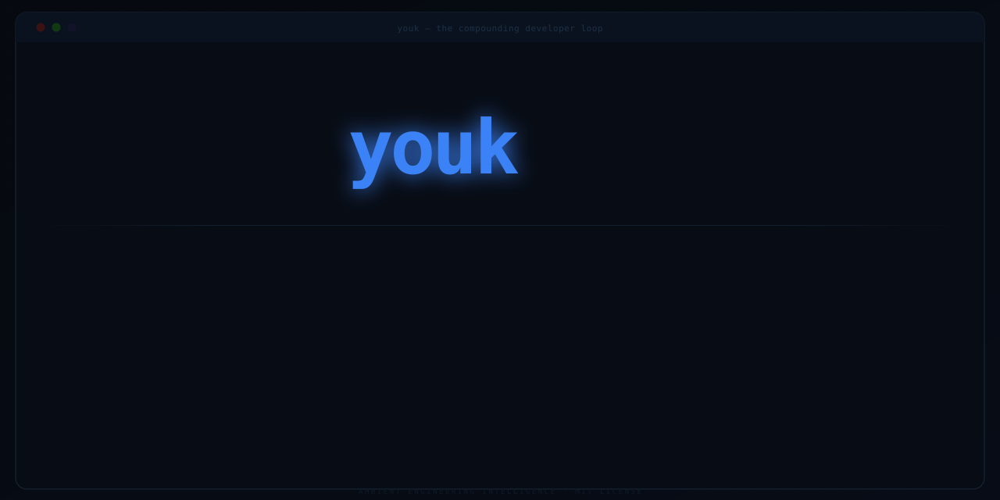

<div align="center">



[](https://github.com/ajinkyabhanudas/youk/actions/workflows/ci.yml)
[](tests/test_health.py)
[](https://www.python.org/)
[](https://modelcontextprotocol.io)
[](LICENSE)

**youk makes your AI coding agent get better at your work the longer you use it. It also checks its own work, so it can tell you whether that's actually happening.**

</div>

---

## The one-minute version

A normal AI agent gets sharper as a conversation goes — you correct it, it adapts. Then the session ends and it's back to zero. Next session you're re-explaining the same context and re-making the same corrections. youk keeps that progress instead of dropping it, and pushes it further.

- **It builds what it's missing.** Hit a task youk has no skill for, and it writes one from what you were actually doing. When a skill trips up during a session, youk fixes that skill before the session ends.
- **It treats a typo differently from a rewrite.** Bigger changes go through gates first — scope, non-functional requirements, a review pass — before any code gets written.
- **It watches its own health.** Every session, youk checks whether the things it built are actually wired into the real loop and being used. Run `/health` for a score and a trend.

Underneath all that is plain memory: your working agreements, decisions, and resume point saved to files that survive a `git clone`. Plenty of tools remember context now. The part worth having is what youk does on top of it.

You don't change how you work. You just install it.

| A normal AI agent | youk |
|---|---|
| Learns within a session, forgets at the end | Carries the progress into the next session |
| Handles every task the same way | Sizes the work and gates the risky parts |
| Forgets the correction you made last week | Patches the skill that got it wrong |
| Can't tell you if it's helping | Shows you a score and a direction |
| Remembers your context | Remembers, and builds skills on top of it |

> **Status:** v1.1.0. Compounding starts on day one; the gains get obvious around session 10–20 as youk tunes to your patterns and the audit log fills.

---

## Start here (60 seconds)

You don't need Docker or an install to try it. Pick your level:

| Level | What you get | Setup |
|---|---|---|
| **1 — youk-lite** | Memory across sessions | Paste ~8 lines into your `CLAUDE.md` → **[docs/youk-lite.md](docs/youk-lite.md)** |
| **2 — full youk** | Memory + skill routing + the self-improving loop | One install command (Docker) ↓ |

**Most people should start at Level 1.** It needs zero dependencies and the value shows immediately. Upgrade when memory alone isn't enough.

### Full install (Level 2)

**macOS / Linux / WSL2 / Git Bash:**
```bash
curl -sL https://raw.githubusercontent.com/ajinkyabhanudas/youk/main/scripts/install.sh | bash
```

**Windows PowerShell** (`curl | bash` won't work here):
```powershell
git clone https://github.com/ajinkyabhanudas/youk "$HOME\.claude\youk"
cd "$HOME\.claude\youk"; Set-ExecutionPolicy -Scope Process -ExecutionPolicy Bypass; .\scripts\install.ps1
```

One command — builds the Docker image, registers the MCP servers, patches your `CLAUDE.md`. First run ~2 min; re-runs are idempotent. Then open any Claude Code session and just work — youk activates itself.

**Prerequisites:** Docker Desktop (running) · Claude Code · Python 3.11+
**Verify anytime:** `bash ~/.claude/youk/scripts/doctor.sh` — checks every dependency and prints a `Fix:` line for anything broken.

Full platform-by-platform walkthrough: **[docs/getting-started.md](docs/getting-started.md)**.

---

## What youk does, in four ideas

1. **It builds skills from your work.** No skill for what you're doing? youk writes one, shaped by your task and your stack. A skill that fails gets fixed in the session it failed. Repeated gaps turn into proposals you approve once.

2. **It sizes the work.** A one-liner and a new subsystem don't get the same handling. Anything substantial runs through gates — scope, non-functional requirements, review — before code.

3. **It checks itself.** Every session, youk reports an `org_score` (0–10) you can watch over time. The score is driven primarily by capability skill invocation (weight 2.0) and session close rate (0.5), with bonuses for autonomy, challenge loop quality, and outcomes. Those are behavioural rates, so they are capped by a structural check: if a skill youk routes to will not load, or a repo skill is unreachable at runtime, the score is held at 6.5 or 8.0 and the reason is the first finding. That ceiling exists because behavioural rates cannot see a broken capability — a skill that never loads is simply never invoked, which looks like developer choice. Three consecutive sessions with no capability skills also cap the score at 6.5. Full formula: [docs/well-architected.md](docs/well-architected.md). That check is what stops youk from quietly turning into the tech debt it's meant to save you from.

4. **It remembers.** Your agreements, decisions, and resume point live in files that reload each session and survive a `git clone`. Groundwork for the three above.

Deeper on any of these: **[docs/well-architected.md](docs/well-architected.md)** · **[PHILOSOPHY.md](PHILOSOPHY.md)** · [Wiki](https://github.com/ajinkyabhanudas/youk/wiki).

---

## Everyday use

Once installed, you mostly just work. A few commands are worth knowing:

| Command | When |
|---|---|
| `/build` | Starting a feature or non-trivial change — runs the gate chain |
| `/done` | End of a session — reviews, captures what was learned, closes the loop |
| `/health` | Anytime — how is youk doing? |
| `/learn` | Extract and save what today taught you (included in `/done`) |

The single most important habit: **type `/done` at the end of a session.** That's what closes the compounding loop — without it, the work happened but youk didn't learn from it.

Full command list and routing detail: **[docs/getting-started.md](docs/getting-started.md)**.

---

## Reference

| Topic | Doc |
|---|---|
| Full setup, every platform | [docs/getting-started.md](docs/getting-started.md) |
| youk-lite (no install) | [docs/youk-lite.md](docs/youk-lite.md) |
| Design principles | [docs/well-architected.md](docs/well-architected.md) · [PHILOSOPHY.md](PHILOSOPHY.md) |
| Guard rails & safety | [docs/guardrails.md](docs/guardrails.md) |
| Variants & configuration | [docs/variants.md](docs/variants.md) |
| Author's live stats | [STATS.md](STATS.md) |
| Everything else | [Wiki](https://github.com/ajinkyabhanudas/youk/wiki) |

**Uninstall** (preserves your knowledge; `--purge` to remove it too):
```bash
bash ~/.claude/youk/scripts/uninstall.sh
```

---

## Contributing & License

Issues and PRs welcome. Run `make checkup-fast` before pushing. MIT — see [LICENSE](LICENSE).
