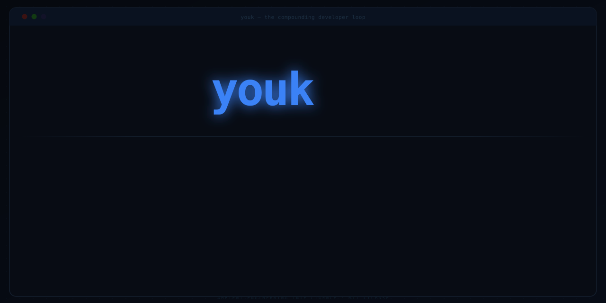

<div align="center">



[](https://github.com/ajinkyabhanudas/youk/actions/workflows/ci.yml)
[](tests/test_health.py)
[](https://www.python.org/)
[](https://modelcontextprotocol.io)
[](LICENSE)

**youk makes your AI coding agent get better at your work the longer you use it, and holds it to evidence before it calls anything done.**

</div>

---

## The one-minute version

A normal AI agent gets sharper as a conversation goes — you correct it, it adapts. Then the session ends and it's back to zero. Next session you're re-explaining the same context and re-making the same corrections. youk saves that progress to disk and builds on it.

- **Skills from your actual work.** Hit a task with no matching skill, and youk writes one from what you were doing. A skill that misfires gets patched before the session ends.
- **Sized work.** A typo and a rewrite go through different gates — scope, requirements, review — scaled to how big the change actually is.
- **Claims checked against evidence.** A claim ("works across hosts," "handles the edge case") gets broken into the sub-claims it depends on, each checked against a grep hit, a test run, or a live call. Anything unresolved blocks "done," enforced at the tool boundary so it isn't a step a model can skip by forgetting.
- **A health score.** `/health` reports whether what got built is actually wired into the real loop and used, with a trend over time.

Underneath all that is plain memory: working agreements, decisions, and resume points saved to files that survive a `git clone`.

youk's core policy is agent-host neutral. Claude Code and Codex integrations declare
their capabilities at the boundary; a missing safety capability blocks rather than
silently weakening the workflow. See [ADR-012](docs/adr-012-agent-host-capability-contract.md).

Optional inference follows the same boundary: `/youk/state/inference-provider.json`
contains provider, model, and schema version only; credentials remain environment-only.
Unavailable or incompatible providers degrade explicitly, and execution records retain
hashes and policy outcomes rather than prompt or response content.

Information governance follows the same rule: explicit, versioned local metadata
declares non-code authority; links remain discovery evidence. Hash lineage catches stale
derived files, while bounded local BM25 retrieval controls context cost without an LLM,
embedding service, or vendor-specific storage. See [information governance](docs/information-governance.md).

You don't change how you work. You just install it.

| A normal AI agent | youk |
|---|---|
| Learns within a session, forgets at the end | Carries the progress into the next session |
| Handles every task the same way | Sizes the work and gates the risky parts |
| Forgets the correction you made last week | Patches the skill that got it wrong |
| Reports "done" because it finished generating | Decomposes the claim, checks every piece against evidence, blocks "done" until each one verifies |
| Can't tell you if it's helping | Shows you a score and a direction |
| Remembers your context | Remembers, and builds skills on top of it |

> **Status:** v1.2.1. Compounding starts on day one; the gains get obvious around session 10–20 as youk tunes to your patterns and the audit log fills.

---

## How it stays grounded

Every decision point in youk is tagged deterministic (code decides, same input always
gives the same answer) or judgment (a model makes a real call). The two paths are kept
separate end to end rather than folded into one generic "the LLM handles it" step.

Patterns, contracts, and sizing decisions are stored as typed records — a Python
dataclass checked against a committed JSON Schema — so a malformed entry raises
immediately instead of surfacing as a mystery three sessions later. A claim like "works
across both hosts" or "the gate is wired" is broken into the sub-claims it actually
depends on and checked against evidence: a grep hit, a test run, a live call. Any
sub-claim left unresolved blocks the claim from being reported done, enforced at the
tool boundary rather than relying on a model to remember to check. Large claims (L/XL)
also need a confirmation from a separate session, since a session checking its own work
inherits that work's blind spots.

Judging whether two differently-worded lessons are the same lesson is a meaning
problem, so that comparison runs through a small, local, offline sentence-embedding
model (~22MB) instead of a string match or another API call — no vendor dependency,
nothing leaves the machine. Sizing a new task draws on logged precedent: past sizing
decisions are retrieved by similarity and appended at the end of the prompt, the
position a transformer attends to most strongly, rather than left in the middle where
it's easy to under-weight.

youk also checks, every session, whether what it built is actually called from the live
routing loop — not just present in the codebase.

None of this runs with zero human involvement, and it isn't meant to. Detection is
automatic and logged durably; deciding what to do about a finding is still a human call.

---

## Start here (60 seconds)

You don't need Docker or an install to try it. Pick your level:

| Level | What you get | Setup |
|---|---|---|
| **1 — youk-lite** | Memory across sessions | Paste ~8 lines into your `CLAUDE.md` → **[docs/youk-lite.md](docs/youk-lite.md)** |
| **2 — full youk** | Memory + skill routing + the self-improving loop | One install command (Docker) ↓ |

**Most people should start at Level 1.** It needs zero dependencies and the value shows immediately. Upgrade when memory alone isn't enough.

### Full install (Level 2)

**macOS / Linux / WSL2 / Git Bash:**
```bash
curl -sL https://raw.githubusercontent.com/ajinkyabhanudas/youk/main/scripts/install.sh | bash
```

The installer registers both MCP servers over HTTP:

```bash
claude mcp add --scope user youk-core --transport http http://127.0.0.1:8001/mcp
claude mcp add --scope user youk-code --transport http http://127.0.0.1:8002/mcp
```

**Windows PowerShell** (`curl | bash` won't work here):
```powershell
git clone https://github.com/ajinkyabhanudas/youk "$HOME\.claude\youk"
cd "$HOME\.claude\youk"; Set-ExecutionPolicy -Scope Process -ExecutionPolicy Bypass; .\scripts\install.ps1
```

One command — builds the Docker image, registers the MCP servers, patches your `CLAUDE.md`. First run ~2 min; re-runs are idempotent. Then open any Claude Code session and just work — youk activates itself.

**Installing a specific version.** Both installers take `YOUK_REF`, which accepts any tag or branch and defaults to the latest on `main`. Released versions are listed under [Releases](https://github.com/ajinkyabhanudas/youk/releases).

```bash
YOUK_REF=v1.2.1 bash -c "$(curl -sL https://raw.githubusercontent.com/ajinkyabhanudas/youk/main/scripts/install.sh)"
```

```powershell
$env:YOUK_REF = "v1.2.1"; .\scripts\install.ps1
```

A ref that does not exist stops the install and names it, rather than quietly falling back to `main` and giving you a version you did not ask for. `YOUK_REF` only applies to a fresh install; if `~/.claude/youk` already exists, the installer says so and leaves it alone. Move an existing install with `git -C ~/.claude/youk fetch --tags && git -C ~/.claude/youk checkout v1.2.1`.

A pinned install stays pinned. Re-running the installer will not drag it back to `main`, and `make update` rebuilds at the pinned version instead of pulling.

**Prerequisites:** Docker Desktop (running) · Claude Code · Python 3.11+
**Verify anytime:** `bash ~/.claude/youk/scripts/doctor.sh` — checks every dependency and prints a `Fix:` line for anything broken.

Full platform-by-platform walkthrough: **[docs/getting-started.md](docs/getting-started.md)**.

---

## What youk does, in five ideas

youk exists so your ability with the agent compounds instead of resetting every
session. `close_cluster` marks a session that ran review, encoded what it learned, and
closed properly — that's what the score below rewards.

1. **Skills from your work.** No skill for the task at hand? youk writes one, shaped by what you're actually doing. A skill that fails gets fixed the same session. Repeated gaps turn into a proposal you approve once.

2. **Sized work.** A one-liner and a new subsystem run through different gates — scope, requirements, review — scaled to the size of the change.

3. **A behavioural score.** `org_score` (0–10) tracks `capability_skill_rate` (weight 2.0) and session close rate (0.5), with bonuses for autonomy, challenge-loop quality, and outcomes. A skill that fails to load or a repo skill that's unreachable caps the score at 6.5–8.0 regardless of the behavioural numbers, since a skill that never loads simply never gets invoked and would otherwise look like a developer's choice. Three sessions in a row with no capability skill also caps it at 6.5. Full formula: [docs/well-architected.md](docs/well-architected.md).

4. **Claim verification.** Where `org_score` tracks behaviour, this checks whether a given task's output is actually correct. A claim gets decomposed into its sub-claims, each checked against evidence — a grep hit, a test run, a live call — and graded by how strong that evidence is. Anything unresolved blocks "done," at the same tool boundary on every host. Gaps a check turns up get logged so the same shape of claim is checked against them next time.

5. **Memory.** Agreements, decisions, and the resume point live in files that reload each session and survive a `git clone`.

Deeper on any of these: **[docs/well-architected.md](docs/well-architected.md)** · **[PHILOSOPHY.md](PHILOSOPHY.md)** · [Wiki](https://github.com/ajinkyabhanudas/youk/wiki).

---

---

## Everyday use

Once installed, you mostly just work. A few commands are worth knowing:

| Command | When |
|---|---|
| `/build` | Starting a feature or non-trivial change — runs the gate chain |
| `/done` | End of a session — reviews, captures what was learned, closes the loop |
| `/health` | Anytime — how is youk doing? |
| `/learn` | Extract and save what today taught you (included in `/done`) |

The single most important habit: **type `/done` at the end of a session.** That's what closes the compounding loop — without it, the work happened but youk didn't learn from it.

A `PreCompact` hook fires before Claude Code compacts the conversation, so contracts
and decisions are written to disk rather than surviving only in context that is about
to be summarised away.

For Codex SessionStart hooks, use `youk-core.session_start_hook`; it wraps the normal
session-start result in Codex's required hook response format. See
[the setup guide](docs/getting-started.md#codex-sessionstart-hooks).

Full command list and routing detail: **[docs/getting-started.md](docs/getting-started.md)**.

---

## Reference

| Topic | Doc |
|---|---|
| Full setup, every platform | [docs/getting-started.md](docs/getting-started.md) |
| youk-lite (no install) | [docs/youk-lite.md](docs/youk-lite.md) |
| Design principles | [docs/well-architected.md](docs/well-architected.md) · [PHILOSOPHY.md](PHILOSOPHY.md) |
| Guard rails & safety | [docs/guardrails.md](docs/guardrails.md) |
| Variants & configuration | [docs/variants.md](docs/variants.md) |
| Author's live stats | [STATS.md](STATS.md) |
| Everything else | [Wiki](https://github.com/ajinkyabhanudas/youk/wiki) |

**Uninstall** (preserves your knowledge; `--purge` to remove it too):
```bash
bash ~/.claude/youk/scripts/uninstall.sh
```

---

## Contributing & License

Issues and PRs welcome. Run `make checkup-fast` before pushing. MIT — see [LICENSE](LICENSE).
